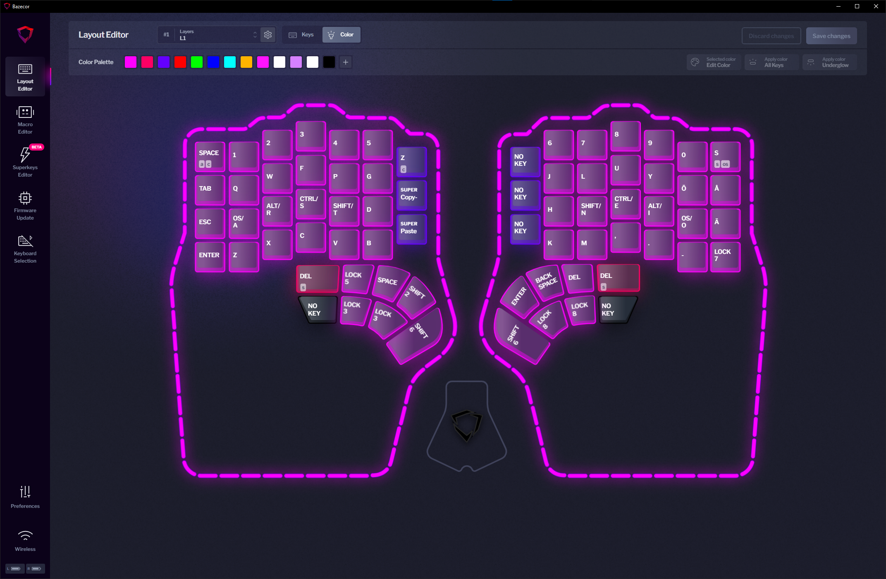
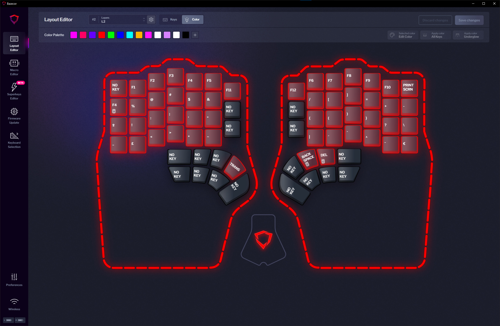
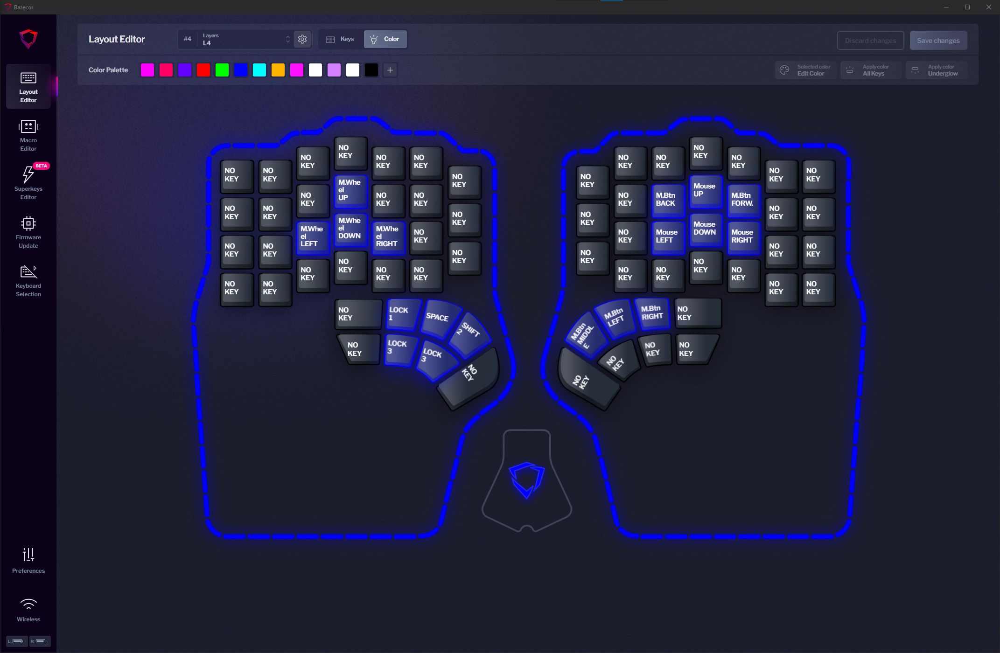
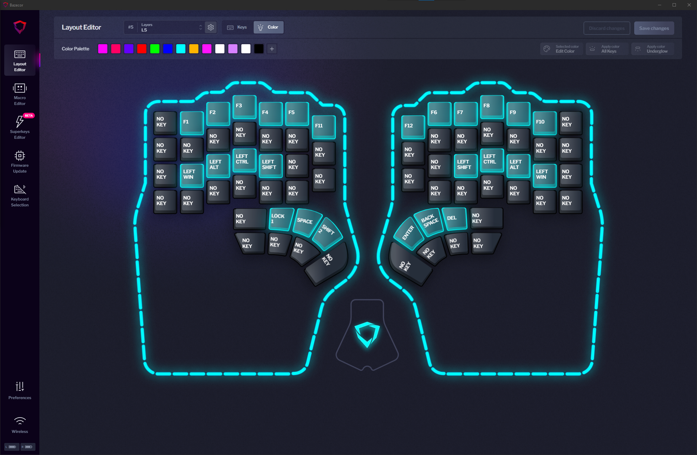
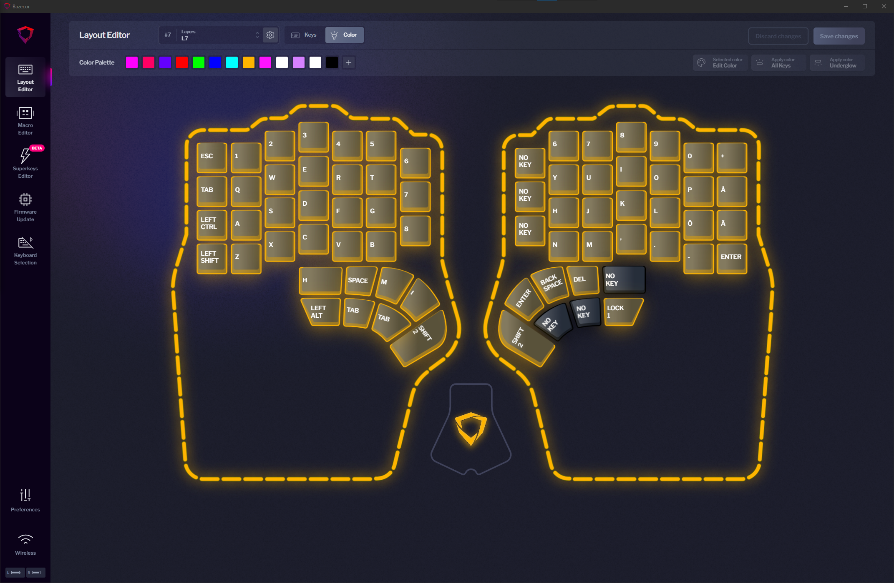
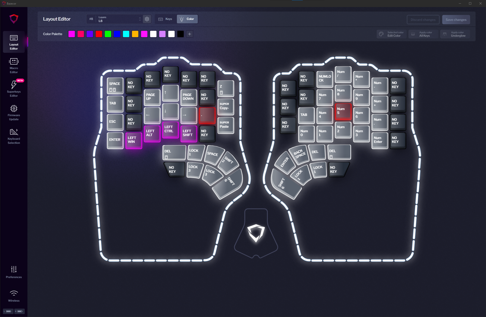

# My Dygma Defy layers

This repo explains my approach to using layers in my Dygma Defy keyboard.  
Importing layers.json to your keyboard might require some tweaking, but it should work on Bazecor version 1.0.0 and firmware version 1.0.9beta

---

## Layers

### Layer 1 (Base)

- Base layer
  - Colemak layout with added scandinavian letters
  - Utilizes home row modifiers (GACS order)
    - For more information on home row mods refer to [this page](https://precondition.github.io/home-row-mods)
  
- Left side
  - Capslock is replaced with escape for easier access
  - Escape is replaced with my shortcut to accept code completion in my IDEs
  - Enter in the bottom left corner helps with one handed use
  - Most of my layer changing is on the left hand thumb cluster
    - Shift 2 -> Symbols
    - Lock 3 -> Navigation
    - Lock 5 -> Modifier + F-keys layer
    - Shift 6 -> IDE shortcuts
  - Inner column utilized for undo, copy, cut, paste
- Right side
  - Backspace replaced with windows snipping tool shortcut
  - Couple of layer changing buttons
    - Shift 6 -> IDE shortcuts
    - Lock 7 -> Gaming layer
    - Lock 8 -> Numpad

---

### Layer 2 (Symbols)

- Symbols layer with F-keys
  - Contains all symbols available in the finnish keymap
    - The point is to never have to use top row numbers for symbols

- Left side
  - Tab replaced with Alt+F4
  - Capslock is there if it is ever needed
- Right side
  - Backspace and delete have ctrl added as a modifier for easier whole word deletion

---

### Layer 3 (Navigation)

- Navigation layer
  - Arrows and modifiers found here when they are needed
  - The way to access Mouse layer
  - Ctrl + b is here to make moving between tmux splits easier with arrow keys

---

### Layer 4 (Mouse)

- Mouse layer
  - Right hand moves cursor
  - Right thumb does clicks to make dragging motions easy
  - Left hand scrolls

---

### Layer 5 (Mods + F-keys)

- Mods + F-keys for when they are needed in combination

---

### Layer 6 (IDE shortcuts)

- JetBrains IDE shortcuts

---

### Layer 7 (Gaming)

- QWERTY Gaming layer
  - Added various common keys to left side thumb cluster to make them easier to access
  - Inner column for more number keys
  - Space is shifted one spot to the left because hand rests on WASD instead of home row

- Things to improve
  - Getting back to base layer is cumbersome if I need to use chat
  - Left Ctrl feels a bit weird being above shift, but the other way around shift felt weird so it's a compromise

---

### Layer 8 (Numpad)

- A bit of color added to help learning the layer

